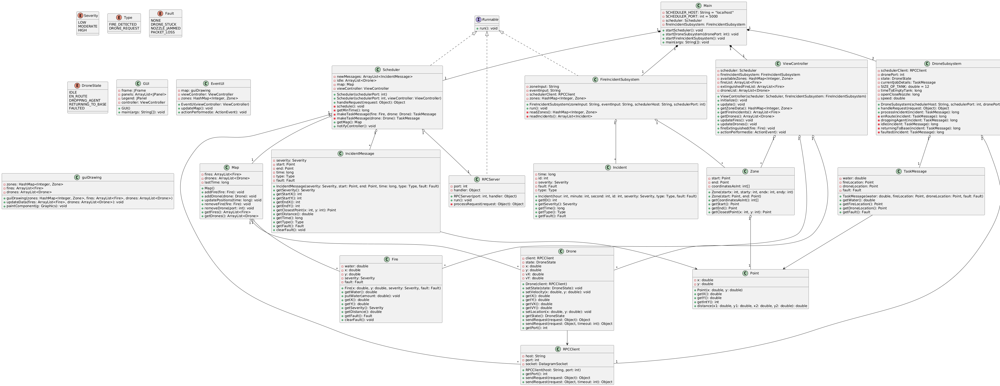
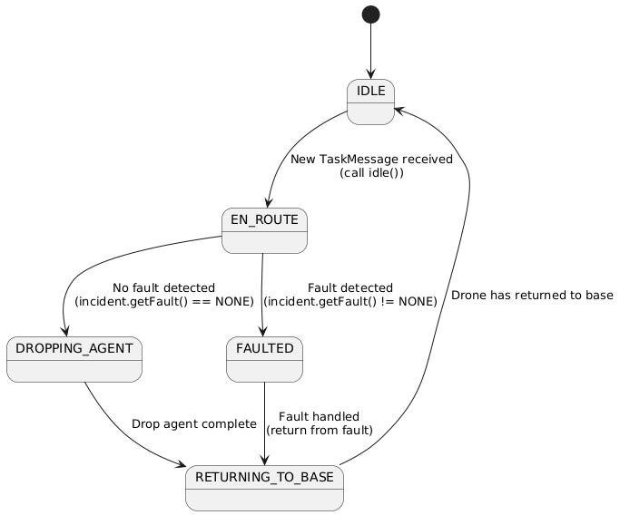
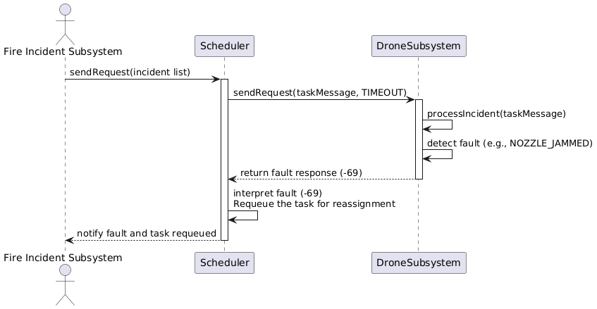
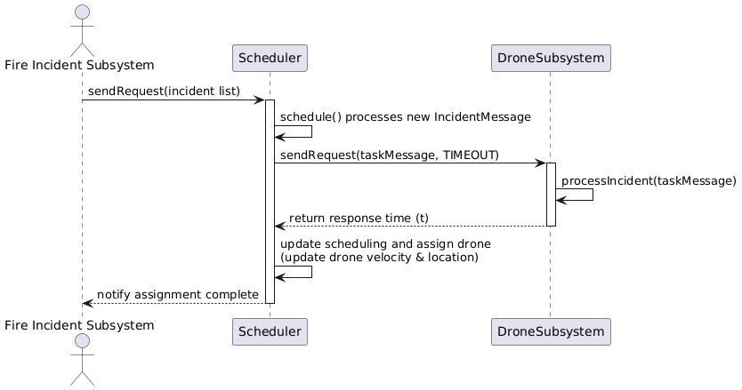
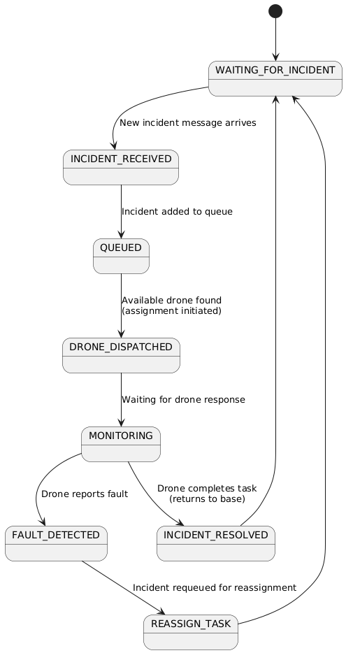

Iteration-5

Contributions
README.TXT - Sam/Lucas  
UML Diagrams - Abdulaziz  
Coding - Lucas/Sam/Ahmed  
Testing - Marc  

How to Run  
Download file using .zip on Github. Extract project.  
Run the Main.java File.
 
How to Run Tests  
*Requires JUnit*  

Changes  
Added Total simulation time to extinguish all fires  
Implemented or enforce capacity limits so that drones can only service zones if they have a full water tank  
Developed a real-time display console GUI to show each drone's current position on a map/grid and report any system faults designed for use by the fire dispatcher at headquarters  

Related Diagrams:  
  
  
  
  

