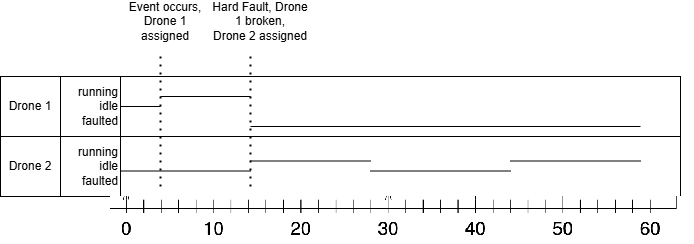

Iteration-4

Contributions
README.TXT - Sam  
UML Diagrams - Lucas  
Coding - Lucas Abdulaziz Marc  
Testing - Ahmed  

How to Run  
Download file using .zip on Github. Extract project.  
Run the Main.java File.
 
How to Run Tests  
*Requires JUnit*  
(Tests for Iteration 4) Run the DroneSubsystemTest, IncidentMessageTest and IncidentTest. If they pass then Faults are detected and handled.

 
Changes implemented in Fourth Iteration  
Addition of fault detection using timing events  
Detection of zone arrival failures and stuck nozzle/bay doors  
Hard fault handling for nozzle/bay door issues (drone shutdown)  
Input file format updated to support fault injection  
System updated to log and display drone faults in status output  
Testing of fault detection and system recovery logic  
Updated Class Diagram to reflect new fault handling components  

Related Diagrams:  
Class Diagram of all interacting systems  

  Timing Diagram  
  

