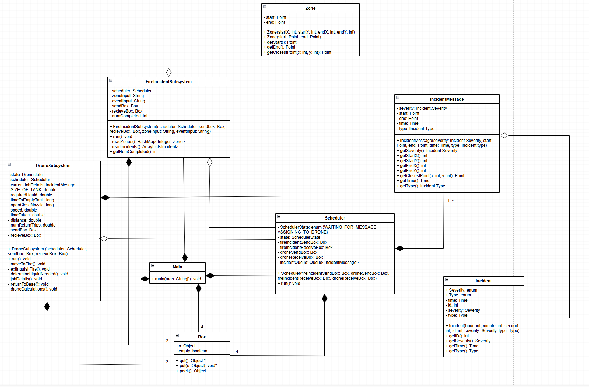

# Iteration-2
Written by Ahmed Babar
## How to Run

1. Download file using .zip on Github. Extract project.
2. Run the Main.java File.

## Changes implemented in Second Iteration

1. Changes to Scheduler implementation. 
- Created States for clear behaviour of Scheduler.
- Updated how Incidents are stored and handled.
- Implemented white-box testing.

2. Changes to Drone implementation.

- Created States for clear behaviour of Drone.
- Implemented white-box testing.

3. Changes to FireSubsystem.
- Implemented white-box testing.

## Related Diagrams:
### Class Diagram of all interacting systems

### UML Sequence Diagram

