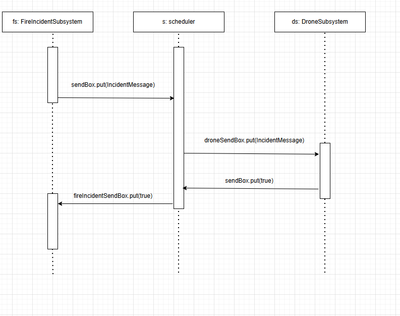

# Iteration-3

### Contributions in this Iteration
# iteration-3
Iteration 3

Contributions
README.TXT - Marc  
UML Diagrams - Ahmed Babar 
Coding - Lucas Sam 
Testing - Abdul Aziz 

## How to Run

1. Download file using .zip on Github. Extract project.
2. Run the Main.java File.

## Changes implemented in Third Iteration
Will be explained by group members. 
- Use of RPCClient/Server architecture
- Scheduling of Multiple Drones
- Testing of newly implemented systems
- Updated Class Diagram

## Related Diagrams:

### Class Diagram of all interacting systems

### UML Sequence Diagram

