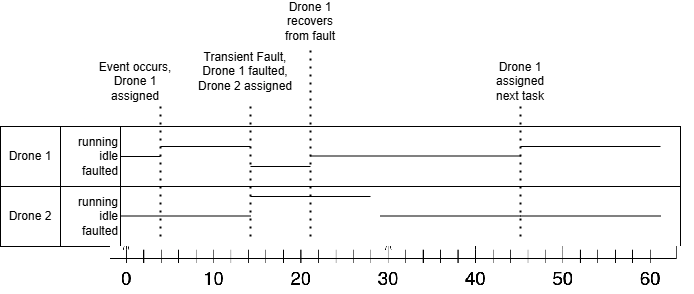

Iteration-4

Contributions
README.TXT - Lucas  
UML Diagrams - Abdulaziz  
Coding - Ahmed, Sam  
Testing - Marc  

How to Run  
Download file using .zip on Github. Extract project.  
Run the Main.java File.
 
How to Run Tests  
*Requires JUnit*  
(Tests for Iteration 5) Run x y z, if they pass a and b.

 
Changes implemented in Fifth Iteration  
Change1  
Change2  
Change3  

Related Diagrams:  
Class Diagram of all interacting systems  
   
  
  
